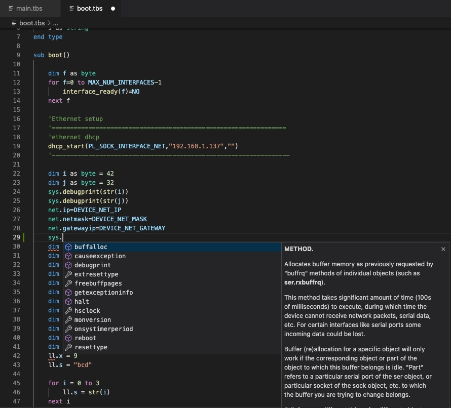

# Tibbo IoT Development for Visual Studio Code

This extension is for developing for [Tibbo devices](https://tibbo.com) running [Tibbo Basic](https://docs.tibbo.com/taiko/lang) applications.

To create a project, use [Cody](https://cody.tibbo.tech), our project configuration tool.

